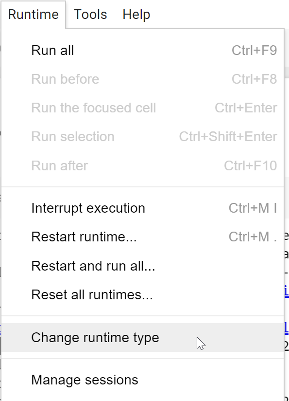
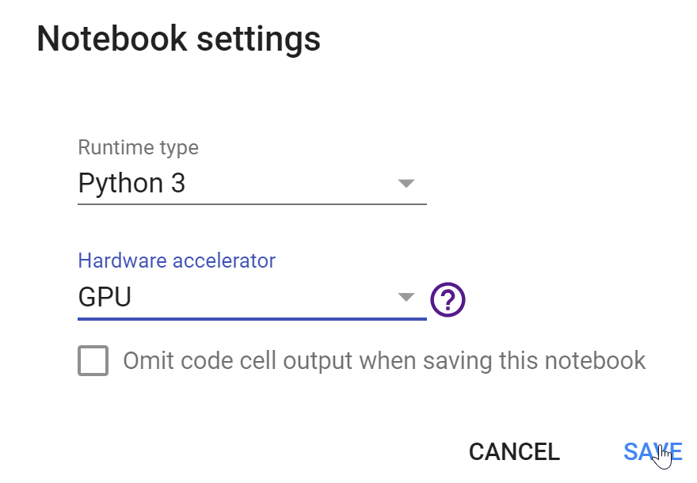

### 無償利用できるGoogleのGPUノートブック

This is a quick guide to starting Practical Deep Learning for Coders using Google Colab. Colab is a service that provides GPU-powered Notebooks for free. It's based on, but slightly different to, regular Jupyter Notebooks, so be sure to read the Colab docs to learn how it works.

NB: Colab is a free service that may not always be available, and requires extra steps to ensure your work is saved. Be sure to read the docs on the Colab web-site to ensure you understand the limitations of the system.
 
### 書籍の各章のオープン

下記のリンクから書籍の各章のノートブックをColabでオープンすることができる。


[1章 ディープラーニングへの旅路][chap01] |
[2章　モデルから実運用へ][chap02] |
[3章　データ倫理][chap03] |
[4章　舞台裏：数字のクラス分類器][chap04] |
[5章　画像クラス分類][chap05] |
[6章　他のコンピュータビジョン問題][chap06] |
[7章　SOTA モデルの訓練][chap07] |
[8章　協調フィルタリングの詳細][chap08] |
[9章　テーブル型データモデルの詳細][chap09] |
[10章　自然言語処理の詳細：RNN][chap10] |
[11章　fastai の中位API によるデータマングリング][chap11] |
[12章　言語モデルを1 から作る][chap12] |
[13章　畳み込みニューラルネットワーク][chap13] |
[14章　ResNet][chap14] |
[15章　アプリケーションアーキテクチャの詳細][chap15] |
[16章　訓練のプロセス][chap16] |
[17章　基礎からのニューラルネットワーク][chap17] |
[18章　CAM を用いたCNN の解釈][chap18] |
[19章　fastai Learner を1 から作る][chap19] |
[20章　おわりに][chap20] |

[app_jupyter]:https://colab.research.google.com/github/fastai/fastbook/blob/master/app_jupyter.ipynb
[chap01]:https://colab.research.google.com/github/fastai/fastbook/blob/master/01_intro.ipynb
[chap02]:https://colab.research.google.com/github/fastai/fastbook/blob/master/02_production.ipynb
[chap03]:https://colab.research.google.com/github/fastai/fastbook/blob/master/03_ethics.ipynb
[chap04]:https://colab.research.google.com/github/fastai/fastbook/blob/master/04_mnist_basics.ipynb
[chap05]:https://colab.research.google.com/github/fastai/fastbook/blob/master/05_pet_breeds.ipynb
[chap06]:https://colab.research.google.com/github/fastai/fastbook/blob/master/06_multicat.ipynb
[chap07]:https://colab.research.google.com/github/fastai/fastbook/blob/master/07_sizing_and_tta.ipynb
[chap08]:https://colab.research.google.com/github/fastai/fastbook/blob/master/08_collab.ipynb
[chap09]:https://colab.research.google.com/github/fastai/fastbook/blob/master/09_tabular.ipynb
[chap10]:https://colab.research.google.com/github/fastai/fastbook/blob/master/10_nlp.ipynb
[chap11]:https://colab.research.google.com/github/fastai/fastbook/blob/master/11_midlevel_data.ipynb
[chap12]:https://colab.research.google.com/github/fastai/fastbook/blob/master/12_nlp_dive.ipynb
[chap13]:https://colab.research.google.com/github/fastai/fastbook/blob/master/13_convolutions.ipynb
[chap14]:https://colab.research.google.com/github/fastai/fastbook/blob/master/14_resnet.ipynb
[chap15]:https://colab.research.google.com/github/fastai/fastbook/blob/master/15_arch_details.ipynb
[chap16]:https://colab.research.google.com/github/fastai/fastbook/blob/master/16_accel_sgd.ipynb
[chap17]:https://colab.research.google.com/github/fastai/fastbook/blob/master/17_foundations.ipynb
[chap18]:https://colab.research.google.com/github/fastai/fastbook/blob/master/18_CAM.ipynb
[chap19]:https://colab.research.google.com/github/fastai/fastbook/blob/master/19_learner.ipynb
[chap20]:https://colab.research.google.com/github/fastai/fastbook/blob/master/20_conclusion.ipynb


Alternatively, head on to the Colab Welcome Page and click on 'Github'. In the 'Enter a GitHub URL or search by organization or user' line enter 'fastai/fastbook'. You will see all the courses notebooks listed there. Click on the one you are interested in using.

NB: One section of chapter 2 uses Voila, which unfortunately is not supported by Colab. For that section, either skip it, or use a different platform such as Gradient (Colab is the only platform which doesn't support Voila).


### GPUの使用

Before running anything, you need to tell Colab that you are interested in using a GPU. You can do this by clicking on the ‘Runtime’ tab and selecting ‘Change runtime type’. A pop-up window will open up with a drop-down menu.


メニューからGPUを選択し、'Save'をクリックする。





### Notebook setup
The first cell contains the code necessary to set up fastai and other libraries you'll need. It looks like this:

```python
!pip install -Uqq fastbook
import fastbook
fastbook.setup_book()
```

Click the "run" triangle on the left of that cell, or press Ctrl-Enter, to execute the cell.

When you run the first cell, you may face a pop-up saying 'Warning: This notebook was not authored by Google'; you should click on 'Run Anyway' to get rid of the warning.




### Using Google Drive

Colab lets you save your work to Google Drive, so when you run the cell, it will ask you to login to Google Drive. You'll need a Google Account to do this.

After you've logged in, you can execute the next cell which imports everything you need from the library you just installed. It looks like this:

```python
from fastbook import *
```

Your Google Drive will be available in a variable called gdrive, which will point to Path('/content/gdrive/My Drive'). When saving files and models during the lessons, you should use directories in this path.

After opening a notebook from Github, you will need to save your work to Google Drive. You can do this by clicking on 'File' and then 'Save'. You should see a pop-up with the following message:


Click on 'SAVE A COPY IN DRIVE'. This will open up a new tab with the same file, only this time located in your Drive. If you want to continue working after saving, use the file in the new tab. Your notebook will be saved in a folder called Colab Notebooks in your Google Drive by default.

For more advanced tips on using Colab effectively, have a look at this blog post.